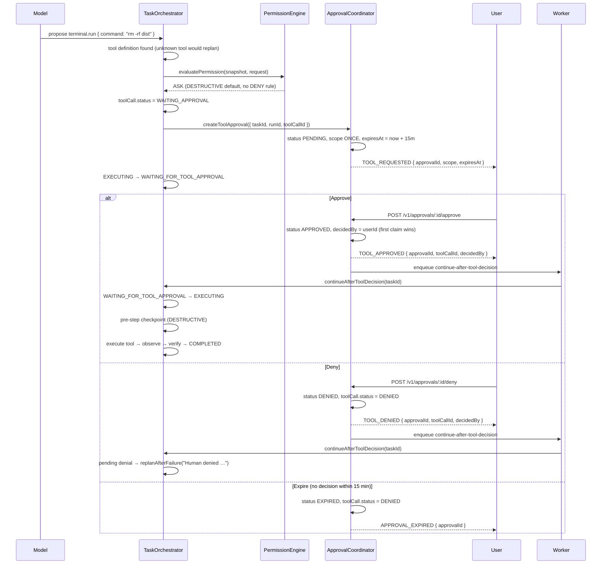

# Permissions and Approvals

How AI Harness decides whether a model-proposed action runs, pauses for a human, or is refused — for the operator watching a run and for the integrator wiring the control surface.

Sources: [Agent runtime architecture](../AGENT_RUNTIME.md), [API reference](../API.md), `backend/packages/permission-engine/src/`, `backend/packages/agent-runtime/src/orchestrator.ts`.

---

## The Three Verdicts

`evaluatePermission()` in `backend/packages/permission-engine/src/evaluate.ts:45` takes an immutable policy snapshot plus a normalized request and returns `{ outcome, reason, matchedRuleId }`, where `outcome` is exactly `ALLOW`, `ASK`, or `DENY` (`backend/packages/permission-engine/src/types.ts:28`).

### Evaluation order

Documented in the header comment of `evaluate.ts:3-14` and implemented at `evaluate.ts:45-134`:

1. **Explicit DENY wins.** Any rule whose `decision === "DENY"` and whose `toolName` matches (exact or wildcard) short-circuits to DENY — checked before everything else, including before an active TASK-scope approval (`evaluate.ts:51-60` vs. `evaluate.ts:67`).
2. **An active TASK-scope approval for the same tool grants ALLOW** (`evaluate.ts:67-76`). ONCE-scope approvals are consumed by the caller before invocation and are not modeled inside the engine (`evaluate.ts:8-9`).
3. **Most-specific non-DENY rule wins**: exact `toolName` match first (`evaluate.ts:78-106`), then `actionPattern` wildcard (`evaluate.ts:108-124`).
4. **Risk-based defaults when nothing matches** (`evaluate.ts:16-27`):

| Risk level | Default | Reason string |
|---|---|---|
| `READ` | `ALLOW` | No matching rule; READ tools are allowed by default |
| `WRITE` | `ASK` | No matching rule; WRITE tools require approval by default |
| `DESTRUCTIVE` | `ASK` | No matching rule; DESTRUCTIVE tools require approval by default |
| `EXTERNAL` | `ASK` | No matching rule; EXTERNAL tools require approval by default |

An unrecognized risk level falls back to the `EXTERNAL` default (`evaluate.ts:126`).

### ALLOW

The execution loop passes the request straight to the Tool Harness (`backend/packages/agent-runtime/src/orchestrator.ts:700-717`). No approval row, no pause.

### ASK

The tool call is parked and a human decision is required. Nothing executes until a user approves (see [Approvals](#approvals)).

Two escalations force ASK even when policy says ALLOW:

- **DESTRUCTIVE risk under an ALLOW rule** → ASK, "ALLOW rule matched but DESTRUCTIVE risk still requires approval" (`evaluate.ts:86-92`). Defense-in-depth: an ALLOW rule may not silently auto-approve destructive work.
- **`.env` / `.env.*` writes** via `filesystem.write` or `filesystem.create` → ASK, regardless of rule or default (`evaluate.ts:62-65`, `94-100`, `112-117`, `127-133`), except when a human already granted TASK scope for that tool (`evaluate.ts:67-76`).

### DENY is absolute

- The DENY rule is evaluated first, so no approval, TASK-scope grant, or ALLOW rule can override it inside the same snapshot.
- The runtime never creates an approval request on DENY — there is no "approve anyway" path. `orchestrator.ts:667-683` marks the tool call `DENIED`, publishes `TOOL_DENIED` with `decision.reason`, then either replans (`replanAfterFailure`) or fails the run.
- The only remedy is changing the workspace policy rule, so the next evaluation sees different rules.

### Companion resource engine

`backend/packages/permission-engine/src/centralized.ts` is a second, resource-oriented engine (`tool | file | git | deployment | admin | memory | mcp | secret` × `read | write | delete | execute | push | deploy | admin`). Among matching policies it resolves `deny` > `approval-required` > `allow`, and a request that matches nothing returns `{ allowed: false, reason: "No matching policy" }` — fail closed (`centralized.ts:81-94`). The per-tool run gate described here uses `evaluatePermission`, not this engine.

---

## The Permission Pipeline

Every model-produced action follows the chain defined in [Agent runtime architecture](../AGENT_RUNTIME.md) §1:

```text
Model Proposal -> Schema Validation -> Permission Evaluation -> Approval if Required -> Tool Execution -> Observation -> State Transition
```

| Stage | What happens | Where |
|---|---|---|
| Model Proposal | Provider returns a plan or a normalized tool call. For a reasoning step with no tool, `proposeNextAction()` asks the implementation model to propose one — "proposals pass through the exact same permission gate". | `orchestrator.ts:617-624` |
| Schema Validation | An unknown tool reference triggers a replan (`orchestrator.ts:626-634`); the Tool Harness then runs `inputSchema.safeParse()` and fails the call with `VALIDATION_ERROR` on bad input (`backend/packages/tool-harness/src/harness.ts:38-47`). Note the ordering nuance: the harness comment states "Permission evaluation happens in the runtime BEFORE this harness is invoked; the harness never grants permissions itself" (`harness.ts:10-16`), so in code schema validation of input runs *after* evaluation, while the doc chain lists it before. | `orchestrator.ts:626-634`, `harness.ts:38-47` |
| Permission Evaluation | `evaluatePermission(ctx.snapshot, { toolName, riskLevel, resourcePath })`. | `orchestrator.ts:660-664` |
| Approval if Required | `ASK` → approval row + `WAITING_FOR_TOOL_APPROVAL`; `DENY` → denial + replan/fail. | `orchestrator.ts:667-698` |
| Tool Execution | Executes through the Tool Harness with timeout and output limits. | `orchestrator.ts:716`, `runAllowedTool()` |
| Observation | `EXECUTING → OBSERVING`, output analyzed, `TOOL_OBSERVED` published, self-fix or replan on error. | `orchestrator.ts:732-789` |

The loop form in [Agent runtime architecture](../AGENT_RUNTIME.md) §6 matches the code: check cancellation → ensure checkpoint → evaluate → branch on DENY/ASK → execute → observe → next step or replan. Every run is bounded by wall-clock duration, model invocations, tool calls, replans, and an optional provider budget (§6); bounds are clamped to the policy snapshot in `orchestrator.ts:384-390`.

---

## Policies

### Workspace instructions vs. workspace policy

Two distinct objects, both scoped to a workspace:

- **Instructions** are versioned prose loaded into model context. `GET /v1/workspaces/:workspaceId/instructions` lists versions; `POST /v1/workspaces/:workspaceId/instructions` creates the next version and requires the `OWNER` role (`backend/apps/api/src/modules/instructions-policy/instructions-policy.routes.ts:13-86`, audited as `INSTRUCTIONS_UPDATED`).
- **Policy** is the machine-evaluated rule set consumed by the permission engine.

### Policy fields

Serialized shape from `instructions-policy.routes.ts:197-216`:

| Field | Effect |
|---|---|
| `requirePlanApproval: boolean` | Plan transitions `PLANNING → WAITING_FOR_APPROVAL` instead of auto-executing (`orchestrator.ts:490-497`) |
| `allowDirectExecution: boolean` | Allows auto-approval of a plan when `requirePlanApproval` is false; if both flags are false the run fails safe with `POLICY_DENIED` (`orchestrator.ts:498-501`) |
| `blockOnReviewFindings: boolean` | Turns review/security findings into a blocking failure |
| `maxTaskDurationSeconds`, `maxToolCallsPerRun`, `maxSubagents` | Run budget inputs |
| `toolRules[]` | `{ id, toolName, actionPattern, riskLevel, decision }` — the rules the engine evaluates |

### Setting policy fields (API)

`PUT /v1/workspaces/:workspaceId/policy` replaces policy fields and, when `toolRules` is present, replaces the whole rule set inside one transaction (`instructions-policy.routes.ts:112-175`). Requires `OWNER`; every change is audited as `WORKSPACE_POLICY_UPDATED`.

```bash
curl -X PUT http://localhost:4000/v1/workspaces/$WORKSPACE_ID/policy \
  -H "Authorization: Bearer $ACCESS_TOKEN" \
  -H "Content-Type: application/json" \
  -d '{
    "requirePlanApproval": true,
    "allowDirectExecution": false,
    "blockOnReviewFindings": true,
    "maxToolCallsPerRun": 40,
    "toolRules": [
      { "toolName": "filesystem.read", "actionPattern": null, "riskLevel": "READ", "decision": "ALLOW" },
      { "toolName": "terminal.run", "actionPattern": null, "riskLevel": "DESTRUCTIVE", "decision": "ASK" },
      { "toolName": "filesystem.delete", "actionPattern": null, "riskLevel": "DESTRUCTIVE", "decision": "DENY" }
    ]
  }'
```

### Setting policy fields (UI)

The workspace settings page reads `GET /v1/workspaces/:workspaceId/policy` and writes `PUT /v1/workspaces/:workspaceId/policy` (`frontend/src/app/(app)/workspaces/[workspaceId]/settings/page.tsx:35,70`). It exposes the boolean flags as toggles and renders existing tool rules read-only; the form submits with `toolRules: undefined` (`page.tsx:72`), so rule edits are an API operation today.

Project-level `GET`/`PUT` `/v1/projects/:id/permissions` manage per-project *team* grants (`DEPLOY`, `EDIT`, `VIEW`) — not agent tool policy (`backend/apps/api/src/modules/projects/projects.permissions.ts:14-70`).

### Per-task confinement

A run never reads live policy; it reads an immutable snapshot:

1. `loadContextFromTask()` calls `buildPolicySnapshot(workspace.policy)` once per context load (`orchestrator.ts:1772-1802`).
2. `buildPolicySnapshot()` copies flags, budgets, and rules with `capturedAt` (`backend/packages/permission-engine/src/snapshot.ts:27-49`).
3. At run start the runtime publishes `POLICY_SNAPSHOT_RECORDED` with `{ policySnapshotId: snapshot.policyId, capturedAt }` (`orchestrator.ts:170-176`), so later policy edits never reinterpret historical execution ([Agent runtime architecture](../AGENT_RUNTIME.md) §3, `backend/packages/permission-engine/src/types.ts:11-14`).
4. Budgets are clamped to `Math.min(DEFAULT_RUN_BOUNDS.*, snapshot.* )` (`orchestrator.ts:386-389`), so per-task confinement is always at most as permissive as both the platform defaults and the workspace policy.

The runtime also cannot mint a broader approval scope than policy allows ([Agent runtime architecture](../AGENT_RUNTIME.md) §12).

---

## Approvals

### ASK becomes an expiring approval request

On `ASK` (`orchestrator.ts:685-698`):

1. `toolCall.status → WAITING_APPROVAL`.
2. `ApprovalCoordinator.createToolApproval()` inserts an `ApprovalRequest` with `status: "PENDING"`, `requestedByActor: "AGENT"`, `requestedScope` (default `"ONCE"`), and `expiresAt = now + 15 minutes` (`backend/packages/agent-runtime/src/approval-coordinator.ts:7,21-53`).
3. `TOOL_REQUESTED` is published with `{ approvalId, toolCallId, scope, expiresAt }`.
4. The task transitions `EXECUTING → WAITING_FOR_TOOL_APPROVAL`; the run returns `AWAITING_TOOL_APPROVAL`.

Scope values are `ONCE` and `TASK` ([Agent runtime architecture](../AGENT_RUNTIME.md) §12).

### Who can resolve

- Decisions require an authenticated user JWT and workspace role `MEMBER` (`backend/apps/api/src/modules/approvals/approvals.routes.ts:31`). "An agent can NEVER approve its own request — decisions always carry an authenticated user id" (`approval-coordinator.ts:11-12`).
- Rate limit: 120 requests / minute / user (`approvals.routes.ts:114`).
- Race-safe claim: only the first decision that finds `status: "PENDING"` mutates the row; a second decision gets `409` (`approvals.routes.ts:60-77`).
- Past `expiresAt` the approval is marked `EXPIRED`, the tool call is set to `DENIED`, `APPROVAL_EXPIRED` is published, and the call fails with an approval-expired error (`approvals.routes.ts:37-58`; sweeper also in `approval-coordinator.ts:112-118`).
- On decision, `TOOL_APPROVED` / `TOOL_DENIED` is published and an audit row `APPROVAL_GRANTED` / `APPROVAL_DENIED` is written (`approvals.routes.ts:79-95`).
- The run resumes by enqueuing `continue-after-tool-decision` (`approvals.routes.ts:97-104`), which the BullMQ worker maps to `orchestrator.continueAfterToolDecision()` — the task must be in `WAITING_FOR_TOOL_APPROVAL`, transitions back to `EXECUTING`, and re-enters the execution loop (`orchestrator.ts:366-398`).

### What the user sees

The task detail page has an `approvals` tab (`frontend/src/app/(app)/tasks/[taskId]/page.tsx:34`) fed by `GET /v1/tasks/:taskId/approvals`. Each pending row renders:

- tool name (`a.toolCall.toolName`) with a warning icon,
- scope and status text, plus `expires <local time>` while pending,
- the redacted `inputSummary` as formatted JSON,
- **Approve once** and **Deny** buttons, shown only while `status === "PENDING"` (`page.tsx:391-428`).

An empty state explains that the run waits here. The agent console shows the same pending approvals (`frontend/src/app/(app)/agent/page.tsx:339-427`).

### REST endpoints

As documented in [API reference](../API.md) (§ Approvals):

| Method | Path | Description |
|---|---|---|
| `GET` | `/v1/approvals` | List pending approvals |
| `POST` | `/v1/approvals/:id/approve` | Approve action |
| `POST` | `/v1/approvals/:id/deny` | Deny action |

Plan-level decisions are separate ([API reference](../API.md) § Plans): `POST /v1/plans/:id/approve`, `POST /v1/plans/:id/reject`.

Implementation notes for integrators:

- Approve/deny are registered as `/v1/approvals/:approvalId/approve|deny` (`approvals.routes.ts:110,130`).
- Listing approvals is implemented per task as `GET /v1/tasks/:taskId/approvals` (`backend/apps/api/src/modules/activity/activity.routes.ts:294`); no route is registered at `GET /v1/approvals` — verify before integrating.
- Plan decisions are registered as `/v1/tasks/:taskId/plans/:planId/approve|reject` (`backend/apps/api/src/modules/plans/plans.routes.ts:38,86`).

### Approval flow



---

## Destructive-Tool Mid-Run Checkpoints

### Triggers

[Agent runtime architecture](../AGENT_RUNTIME.md) §13 defines three checkpoint triggers: before the first filesystem write, before a destructive action, and manually by the user. A checkpoint holds a *state reference*, not a database copy (§13).

### Pre-execution checkpoint

`executionLoop()` calls `checkpoints.tryCreatePreExecution()` before the first step (`orchestrator.ts:545-547`).

### Pre-step checkpoint before DESTRUCTIVE tools

Two call sites, both guarded by `definition.riskLevel === "DESTRUCTIVE"`:

- Approved-but-pending tool resumed after approval (`orchestrator.ts:565-579`).
- The normal ALLOW path (`orchestrator.ts:701-714`).

`tryCreatePreStep()` (`backend/packages/agent-runtime/src/checkpoint-manager.ts:98-165`) only creates a real checkpoint when a connected Local Bridge owns the project root; it calls the bridge's `checkpoint.create`, persists a `Checkpoint` row, and publishes `CHECKPOINT_CREATED` with `{ checkpointId, kind, headBefore, createdStash, label, toolName, stepId }`. Otherwise it publishes `CHECKPOINT_SKIPPED` with an exact reason (`BRIDGE_DISCONNECTED`, `BRIDGE_GATEWAY_UNAVAILABLE`, `CLOUD_SANDBOX_NOT_PROVISIONED`, `BRIDGE_CHECKPOINT_FAILED: …`) — "never faked" (`checkpoint-manager.ts:17-24`). Checkpoint failures are logged and never block tool execution (`orchestrator.ts:576-578,711-713`). The last 10 checkpoints per project are kept (`checkpoint-manager.ts:88-89`).

### Rollback

`POST /v1/checkpoints/:checkpointId/rollback` requires `confirm: true`, workspace role `MEMBER`, a `git` state reference, and a `CONNECTED` bridge; it executes `ckpt.rollback` through the bridge gateway, audits `CHECKPOINT_ROLLED_BACK`, and publishes `STATE_CHANGED` (`backend/apps/api/src/modules/activity/activity.routes.ts:184-260`). [Agent runtime architecture](../AGENT_RUNTIME.md) §13 adds: display affected scope, user confirms, verify the result, record the event — and "external side effects are explicitly not assumed reversible."

### Backup-before-reset pattern

Workspace-level destructive restore follows the same shape (`backend/apps/api/src/modules/workspaces/workspaces.backup.routes.ts`):

```bash
# 1. Snapshot first
curl -X POST http://localhost:4000/v1/workspaces/$WS_ID/backup \
  -H "Authorization: Bearer $ACCESS_TOKEN"

# 2. Restore only with explicit confirmation (OWNER only)
curl -X POST http://localhost:4000/v1/workspaces/$WS_ID/restore \
  -H "Authorization: Bearer $ACCESS_TOKEN" \
  -H "Content-Type: application/json" \
  -d "{ \"backupId\": \"$BACKUP_ID\", \"confirm\": true }"
```

`confirm !== true` is rejected with a validation error (`workspaces.backup.routes.ts:221-223`), the backup must belong to the workspace, and at most 10 backups are retained with a 24-hour TTL (`workspaces.backup.routes.ts:36-37,140-150`). The restore is audited as `BACKUP_RESTORED` with counts of restored projects and tasks.

---

## Security Scan Gate

`orchestrator.ts:869-913` runs a mandatory scan between the review stage and the `REVIEWING → COMPLETED` transition:

- `runSecurityScan(taskId, plan.affectedFiles)` (`orchestrator.ts:1228-1275`) is a lightweight static check over up to 50 affected files with these rules:

| Rule | Severity | Pattern |
|---|---|---|
| `HARDCODED_SECRET` | high | `api_key/secret/password = "<8+ chars>"` |
| `SQL_INJECTION` | high | `${…}` interpolation next to SQL keywords, or a backtick template passed to `query(` |
| `XSS_DANGEROUS_HTML` | medium | `dangerouslySetInnerHTML` without sanitize/escape/DOMPurify |
| `CODE_INJECTION` | high | `eval()` / `Function()` constructor |
| `MISSING_AUTH` | medium | `app.get/post/put/delete/patch(` without `authenticate`/`requireWorkspaceRole`/`preHandler` |

- Any findings publish a `SECURITY_SCAN` event with `{ findings, scannedFiles }` (`orchestrator.ts:876-882`) and are attached to `RUN_COMPLETED` as `securityFindings` (`orchestrator.ts:921`).
- **Blocking is opt-in**: critical/high findings fail the run with `RUN_BLOCKED_BY_REVIEW` and `REVIEW_BLOCKED` only when the policy flag `blockOnReviewFindings` is true (`orchestrator.ts:883-895`). Without the flag the run still reaches `COMPLETED`, with findings recorded.
- If the scan itself throws, the run logs `security scan failed — continuing to COMPLETED` (`orchestrator.ts:905-908`).

> **Verification note:** this gate is implemented in `orchestrator.ts`, not described in [Agent runtime architecture](../AGENT_RUNTIME.md). Treat "scan always runs" as verified in code; treat "runs must pass the scan to complete" as true only when `blockOnReviewFindings` is enabled.

---

## Worked Example: `rm -rf`

Assume a default workspace policy (no rules matching `terminal.run`).

### 1. Proposal

```bash
# tool call proposed by the implementation model
terminal.run  {"command": "rm -rf dist"}
```

`terminal.run` is registered with risk level `DESTRUCTIVE` (`backend/packages/tool-harness/src/definitions.ts:62`).

### 2. Evaluation

`evaluatePermission()` finds no DENY rule, no TASK-scope approval, no exact/wildcard ALLOW rule → `DEFAULT_BY_RISK["DESTRUCTIVE"]` → **ASK** ("No matching rule; DESTRUCTIVE tools require approval by default", `evaluate.ts:19-22`).

### 3. Approval request

Tool call → `WAITING_APPROVAL`; approval row created with a 15-minute expiry; `TOOL_REQUESTED` emitted; task → `WAITING_FOR_TOOL_APPROVAL`. The user sees a card with the tool name, `scope: once`, the expiry time, and the JSON `inputSummary` containing the command.

### 4a. Approve

`POST /v1/approvals/:id/approve` → approval `APPROVED`, audit `APPROVAL_GRANTED`, `TOOL_APPROVED` emitted, `continue-after-tool-decision` queued. The worker returns the task to `EXECUTING`; the resumed loop finds the approved-but-pending tool call and, because the tool is DESTRUCTIVE, creates a **pre-step checkpoint** first (`orchestrator.ts:565-579`, same guard as the normal path at `orchestrator.ts:701-714`), then executes it directly through `runAllowedTool()`. Two caveats on this resume path: it does not fire `beforeToolCall`/`afterToolCall`, and it does not enter `OBSERVING` / emit `TOOL_OBSERVED` — on failure it replans, on success the loop advances to the next step (`orchestrator.ts:580-594`). Both belong to the main step path (`orchestrator.ts:715-744`).

### 4b. Deny

`POST /v1/approvals/:id/deny` → approval `DENIED`, tool call `DENIED`, audit `APPROVAL_DENIED`, `TOOL_DENIED` emitted. On continuation the runtime finds the unhandled denial and calls `replanAfterFailure("Human denied …")` (`orchestrator.ts:596-604`) — the agent must produce a plan that does not include the refused action, or the run fails once replan budget is exhausted.

### 4c. Ignore

After 15 minutes the approval expires, the tool call becomes `DENIED`, `APPROVAL_EXPIRED` is published, and any later decision returns an approval-expired error.

### Variant: policy denies it outright

```json
{ "toolName": "terminal.run", "riskLevel": "DESTRUCTIVE", "decision": "DENY" }
```

Now step 2 returns **DENY** immediately: no approval row is ever created, `TOOL_DENIED` carries the rule reason (`Denied by explicit policy rule for terminal.run`), and the runtime replans or fails. Nothing in the UI can authorize that tool until the policy changes.

### Variant: plan-level gate

With `requirePlanApproval: true`, the run first parks at `WAITING_FOR_APPROVAL` after `PLAN_CREATED` (`orchestrator.ts:490-497`); the human approves or rejects the plan before any tool evaluation happens.

---

## Related reading

- [Agent runtime architecture](../AGENT_RUNTIME.md) — pipeline, state machine, checkpoint and event contracts
- [API reference](../API.md) — approval and activity endpoints, WebSocket event types
- [Hooks and events](../guides/hooks-and-events.md) — realtime delivery, replay, lifecycle hooks, metrics
